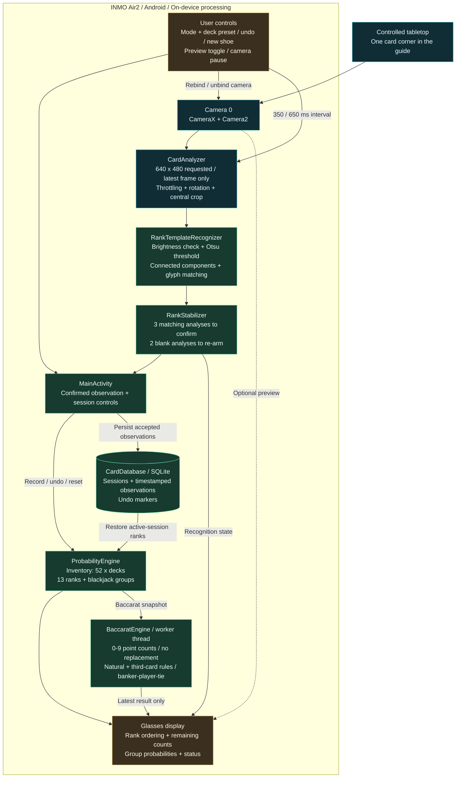

<div align="center">

# INMO Card Lab

**CLASSIC GAMES. VISIBLE PROBABILITY.**

A wearable research prototype for tabletop gaming, probability education, and spatial computing.

**INMO Air2 / Configurable shoes / Blackjack + Baccarat / On-device processing**

[What's new in v0.2](RELEASE_NOTES_0.2.md) &nbsp; | &nbsp; [Download v0.2](https://github.com/jasonet/glasses-imoapp/releases/tag/v0.2) &nbsp; | &nbsp; [Architecture](#system-architecture) &nbsp; | &nbsp; [Quick Start](#quick-start)

</div>

---

## The Table Becomes a Probability Lab

A card enters the frame. Its rank is recognized. A compact display updates the remaining shoe and the distribution of the next draw, directly in the wearer's field of view.

INMO Card Lab explores how smart glasses can make the mathematics of classic card games tangible. Version **0.2** supports **blackjack and baccarat** with configurable shoes. A fresh installation still starts in **two-deck blackjack**: 104 cards and 13 ranks. Recognition, probability calculations, and session storage run on the glasses.

Built for controlled simulations, game-design workshops, and wearable interface research, this is an early engineering prototype. It recognizes **one card corner at a time inside a central guide**, rather than automatically interpreting an entire table.

## Experience Scenarios

| Setting | The experience | Research focus |
| --- | --- | --- |
| **The Probability Table** | Two decks on green felt. Present a card, watch the numbers shift, and discuss why the next-draw distribution changes. | Sampling without replacement and conditional probability. |
| **The Wearable Demo** | A dark, high-contrast display places ranks and colored status indicators over a subdued camera preview. Hide the preview to keep the numbers in focus. | Glanceable information and hands-free interaction. |
| **The Game-Design Workshop** | Record a controlled dealing sequence, inspect the remaining composition, and undo a mistaken observation. | Transparent numerical feedback for tabletop simulations. |
| **The Vision Bench** | Present known cards under different lighting, distances, and angles, then compare recognition with the actual sequence. | Template calibration and observation reliability. |

These scenarios describe guided prototype use. Version 0.2 does not include automated benchmarking, a table simulator, or multi-player tracking.

## What v0.2 Delivers

- **On-device rank recognition.** CameraX feeds a pure Kotlin template recognizer for A, 2-10, J, Q, and K, tailored to the Air2's 32-bit environment.
- **Configurable inventory.** Choose 2, 4, or 6 decks for blackjack; baccarat also offers an 8-deck reference preset. Every rank starts with `4 * decks` cards. The display sorts all 13 ranks by remaining-card probability.
- **Blackjack-oriented groups.** Low cards `2-6`, neutral cards `7-9`, ten-value cards `10/J/Q/K`, and aces appear as four separate summaries.
- **Baccarat round probabilities.** A separate engine enumerates banker/player/tie outcomes using the remaining shoe and standard third-card rules. The fourth summary shows the probability of the next card having zero points (`10/J/Q/K`).
- **Temporal confirmation.** Three consecutive matching analyzed frames confirm a rank; two consecutive frames with no recognized rank re-arm detection.
- **Persistent configurations.** SQLite stores each session's game mode and deck count alongside observations. Relaunching restores the active shoe. Existing v0.1 history migrates as blackjack; changing presets creates a new session and retains old records.
- **Display and camera controls.** Switch between preview and reduced-analysis display modes, or pause the camera completely.

## System Architecture



The analyzer uses a single worker thread and `KEEP_ONLY_LATEST` backpressure. Confirmed ranks reach the activity, which updates the in-memory inventory, writes the observation to SQLite, and refreshes the display. On launch, stored active-session observations reconstruct that inventory. Frames are processed in memory; the app has no image/video recording pipeline or declared `INTERNET` permission.

Source entry points: [camera analysis](app/src/main/java/com/jacb/inmocards/CardAnalyzer.kt), [recognition](app/src/main/java/com/jacb/inmocards/RankTemplateRecognizer.kt), [confirmation](app/src/main/java/com/jacb/inmocards/RankStabilizer.kt), [inventory](app/src/main/java/com/jacb/inmocards/ProbabilityEngine.kt), [baccarat](app/src/main/java/com/jacb/inmocards/BaccaratEngine.kt), [presets](app/src/main/java/com/jacb/inmocards/ShoeConfig.kt), [storage](app/src/main/java/com/jacb/inmocards/CardDatabase.kt), and [interface](app/src/main/java/com/jacb/inmocards/MainActivity.kt).

## The Probability Model

For rank `r`, with `c(r)` recorded observations and `N` cards remaining:

```text
remaining(r) = 4 * decks - c(r)
N            = sum of remaining cards across all 13 ranks
P(next = r)  = remaining(r) / N, for N > 0
```

| Display group | Ranks | Initial cards | Initial probability |
| --- | --- | ---: | ---: |
| Low | 2, 3, 4, 5, 6 | 40 | 38.46% |
| Neutral | 7, 8, 9 | 24 | 23.08% |
| Ten-value | 10, J, Q, K | 32 | 30.77% |
| Ace | A | 8 | 7.69% |

For the default two-deck shoe, each individual rank starts at `8 / 104`, approximately **7.69%**. After one ace is recorded, the next-ace probability becomes `7 / 103`, approximately **6.80%**; each other rank becomes `8 / 103`, approximately **7.77%**. Fresh-shoe rank and blackjack-group probabilities are identical across deck counts; the impact of each observed removal changes with the shoe size. Percentages display up to two decimal places, so displayed totals can differ slightly from 100%.

The model assumes a uniformly shuffled shoe, no replacement during the session, and an accurate record of removed cards. Missed cards, duplicate observations, unrecorded removals, or reshuffling without a reset invalidate the recorded composition. An exhausted rank cannot be recorded again; an empty shoe displays zero probabilities until a new session is started. These values describe the next draw, not a hand's win probability or a guaranteed outcome.

## Baccarat Model and Deck Presets

| Mode | Available decks | Initial cards | Default behavior |
| --- | --- | --- | --- |
| Blackjack | 2 / 4 / 6 | 104 / 208 / 312 | Fresh installation starts at 2. |
| Baccarat | 2 / 4 / 6 / 8 | 104 / 208 / 312 / 416 | Select explicitly; 2 / 4 are simulation presets. |

The [Macao DICJ published baccarat rules](https://www.dicj.gov.mo/web/cn/rules/Bacara.html) describe 6-12 decks and the standard draw procedure. An [official Macao court record](https://www.court.gov.mo/sentence/zh/17059) documents an eight-deck shoe in actual venue operations. This supports the **8-deck reference preset**, without implying that every current venue uses the same shoe. Check venue-specific rules for any particular comparison.

The baccarat engine merges `10/J/Q/K` into zero points, maps A to one, and counts other ranks at face value. It enumerates alternating player/banker opening draws without replacement, then applies natural stops and the third-card table. Branch weights use the number of cards remaining at each draw. The resulting banker/player/tie values sum to one, apart from floating-point rounding. An intact eight-deck shoe yields approximately **45.8597% banker / 44.6247% player / 9.5156% tie**.

These are probabilities for a **new complete round dealt from the recorded remaining shoe**. They update after every accepted observation, undo, or reset. They are not conditional odds for a partially dealt hand: the camera does not assign cards to player or banker. Read the round values between completed rounds after recording all exposed cards. The separate rank grid and zero-point summary always describe the next single draw.

Calculations run on a dedicated worker only when the inventory changes. Superseded work is cancelled; obsolete results cannot replace newer session data. Fewer than six remaining cards disables round probabilities and prompts a new shoe. The model does not simulate cut-card placement, unidentified burn cards, continuous shuffling, side bets, commissions, or payouts; incomplete observations remain a source of model error.

## Quick Start

**Target:** INMO Air2 running Android 9 / API 28 with `armeabi-v7a`. The application minimum is API 26. Version 0.2 is a **debug APK for prototype testing**; its interface currently uses Chinese labels.

1. Download [the v0.2 APK](https://github.com/jasonet/glasses-imoapp/releases/download/v0.2/INMO-Card-Lab-0.2-debug.apk) and [SHA256SUMS-0.2.txt](https://github.com/jasonet/glasses-imoapp/releases/download/v0.2/SHA256SUMS-0.2.txt) into the same directory, or build from source below. The published v0.1 release remains available separately.
2. Enable USB debugging on the glasses, connect them to the computer, and approve the device authorization prompt.
3. Verify and install from that directory:

```bash
# macOS: verify the APK against the published checksum.
grep 'INMO-Card-Lab-0.2-debug.apk$' SHA256SUMS-0.2.txt | shasum -a 256 -c -
adb devices
adb install -r INMO-Card-Lab-0.2-debug.apk
adb shell am start -n com.jacb.inmocards/.MainActivity
```

Grant camera permission when prompted. Use the **mode / deck selector** above the probabilities to choose a preset and start a fresh shoe; cancelling preserves the current session. A long-press on the bottom New shoe button restarts with the current mode and deck count. Hold one card's corner numeral or letter in the yellow guide until confirmation, then remove it until the app is ready for the next card. Three analyzed matches take roughly a second in preview mode; actual timing depends on device throughput and recognition stability.

The four bottom controls, from left to right, are **Undo**, **New shoe (long press)**, **Display mode**, and **Pause/resume camera**. Undo reverses the latest recorded rank. Starting a new shoe creates a new active session and retains earlier session records in the database.

## Display and Power Behavior

| Mode | Camera preview | Recognition | Intended use |
| --- | --- | --- | --- |
| Preview | Visible, with alignment guide | At most one analysis per 350 ms | Positioning cards and evaluating recognition. |
| Reduced-analysis display | Preview and guide hidden | At most one analysis per 650 ms | Keeping probability readouts visible with less processing. |
| Paused | Hidden; camera use cases unbound | Stopped | Reviewing the current display between observations. |

The camera configuration requests 640 x 480 analysis frames and a 5-15 FPS capture range; the device determines the negotiated capture behavior. Capture FPS and recognition cadence are separate. Status text refreshes only when its message or color changes. The screen remains awake while the activity is active, including during camera pause. Battery savings have not yet been quantified.

## Responsible Use

The intended deployment is **consensual, non-wagering research and education**: private tabletop simulations, approved demonstrations, and game-design experiments. Obtain participant consent and venue approval before camera use. Do not use the prototype for covert assistance or in games, competitions, or venues that prohibit electronic devices.

This repository makes no claim of gaming certification, regulatory approval, or suitability for regulated deployment. Version 0.2 has no betting, payment, wager-sizing, or automated strategy functionality. Any commercial deployment needs a separate review of applicable rules, permissions, and data handling.

Recognition and observation storage are local to the application. Android backup is currently enabled in the manifest, so OS or device backup behavior must be reviewed before promising strict device-only data retention. Session records include timestamps; plan their retention and deletion for any organized study.

## Engineering Scope and Next Steps

The current recognizer uses generated glyph templates and needs calibration against real card fonts, lighting, motion, and viewing angles. It does not distinguish suits, physical card identities, table seats, player hands, or the dealer's upcard. Temporal confirmation reduces repeated observations but cannot guarantee physical-card deduplication. No recognition-accuracy or battery-life benchmark is published.

Planned research directions, **not included in v0.2**:

- Evaluate recognition against labeled, consented card samples and measure missed and duplicate observations.
- Add table regions and explicit hand assignment before exploring blackjack bust probabilities, blackjack dealer outcomes, or in-progress baccarat hands.
- Measure camera, CPU, and display energy use, then tune analysis cadence and rendering.
- Explore a more minimal monochrome display with sparse colored indicators and English UI localization.

## Build and Project Notes

The project uses Kotlin, Java 17, Android SDK 34, and CameraX 1.3.4. The recognizer runs without ML Kit or TensorFlow Lite inference; this avoids the native OCR path associated with `SIGILL` on the target device.

With JDK 17 and Android SDK 34 configured through `ANDROID_HOME` or an untracked `local.properties`:

```bash
./gradlew testDebugUnitTest assembleDebug
```

The debug APK is generated at `app/build/outputs/apk/debug/app-debug.apk`. JVM tests cover shoe capacities, point-value mapping, every banker draw-table entry, fresh-shoe probabilities, and an independent physical-card permutation oracle. Android instrumentation tests cover v1 database migration, preset restoration, undo, and reset rollback; run them with `./gradlew connectedDebugAndroidTest` on a connected test device. These tests do not establish camera accuracy or hardware performance.

See the [v0.1 release](https://github.com/jasonet/glasses-imoapp/releases/tag/v0.1) for the APK, source archive, and checksums. The original [core feature specification](CORE_FEATURE_PROMPT.md) and [release notes](RELEASE_NOTES_0.1.md) are available in Chinese.

Release numbering follows `v0.1`, `v0.2`, `v0.3`, and so on. Uploading a new versioned checksum file with its packaged APK and source to `dist` triggers the release workflow. It calculates the next minor version from the latest published release, verifies checksums and the source version, imports the source, and creates the tag and release. Build the matching APK version before uploading; this workflow does not relabel or rebuild existing binaries.
